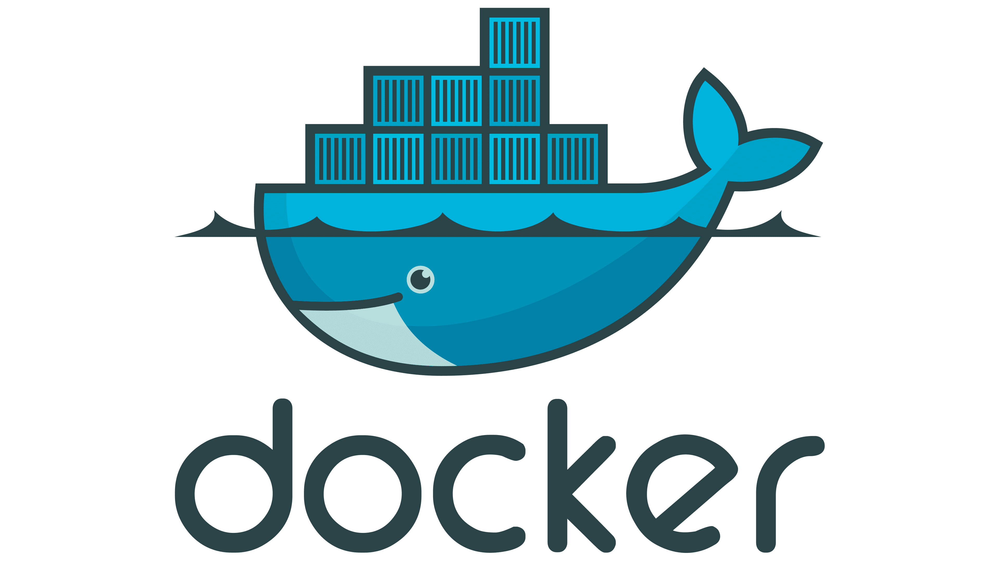
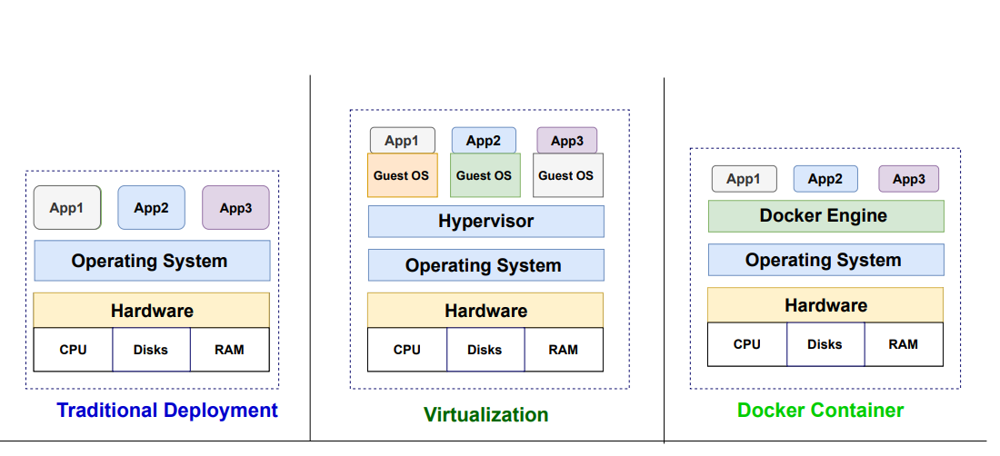

### What is Docker?

Docker is an open-source platform that automates the deployment, scaling, and management of applications in lightweight, portable containers. Containers are a form of virtualization, but unlike traditional virtual machines, they are more efficient because they share the host system's kernel and resources.

### Brief Overview of Docker

- **Introduction:**
  - Docker was introduced in 2013 and has since become a standard for containerization.
  - It simplifies the process of developing, shipping, and running applications by encapsulating them in containers that can run consistently across different environments.

- **Key Components:**
  - **Docker Engine:** The core part of Docker that creates and runs containers.
  - **Docker Images:** Immutable, read-only templates that define what is inside the container, including the operating system, application code, dependencies, and configuration.
  - **Docker Containers:** Runtime instances of Docker images. They are isolated environments that contain everything needed to run a specific application or service.
  - **Docker Hub:** A cloud-based registry service for finding and sharing container images with the community.

- **Docker vs. Traditional Virtual Machines:**
  - Virtual machines run entire operating systems, each with its own kernel, on top of a hypervisor, making them heavier and slower to start.
  - Docker containers, on the other hand, share the host OS's kernel and resources, which leads to faster startup times, less overhead, and more efficient resource usage.

### Benefits of Containerization

- **Consistency Across Environments:**
  - Containers encapsulate everything the application needs to run, ensuring that it works the same way in development, testing, and production environments. This "write once, run anywhere" capability eliminates the common "it works on my machine" problem.

- **Efficiency and Lightweight:**
  - Containers are more lightweight compared to virtual machines. They share the host OS’s kernel, which reduces the overhead and improves performance.
  - A single machine can run many more containers than it could virtual machines.

- **Isolation and Security:**
  - Containers provide isolation at the application level. This means that each container runs independently, without affecting others. If one container crashes or is compromised, it doesn't impact other containers on the same host.
  - Security mechanisms in Docker provide control over resources, access, and the environment in which the container runs.

- **Portability:**
  - Containers are highly portable. Once you create a Docker image, it can be run on any system that supports Docker, whether it’s a local machine, a cloud environment, or a cluster.

- **Scalability and Management:**
  - Docker makes it easier to scale applications. Containers can be quickly spun up or down based on demand.
  - Docker also integrates well with orchestration tools like Kubernetes, which manage and automate the deployment, scaling, and operation of containerized applications across clusters.

- **Simplified CI/CD Pipelines:**
  - Docker containers can be used to streamline Continuous Integration and Continuous Deployment (CI/CD) pipelines by providing consistent environments for building, testing, and deploying applications.
  - This reduces the time it takes to move from code to production and minimizes errors due to environmental differences.

- **Diagram:**

  - A diagram comparing traditional VMs and Docker containers to illustrate the difference in architecture, resource usage, and efficiency.
  
### Why Use Docker with ROS?

Using Docker with ROS (Robot Operating System) offers several advantages that can significantly enhance the development, testing, and deployment of robotic applications. Here’s why Docker is a powerful tool when working with ROS:

### Simplifying ROS Environment Setup

- **Complex Dependencies:**
  - ROS applications often rely on a wide array of packages, libraries, and specific versions of software. Setting up a ROS environment manually can be time-consuming and prone to errors due to dependency conflicts or version mismatches.
  
- **Docker to the Rescue:**
  - Docker allows you to encapsulate all the dependencies, configurations, and the ROS environment itself into a single, portable container. 
  - By using a Dockerfile, you can automate the setup of a ROS environment, ensuring that all necessary dependencies are correctly installed and configured.

- **Quick Start for New Projects:**
  - With Docker, you can quickly spin up a new ROS environment by simply pulling a pre-configured ROS Docker image. This is particularly useful when starting a new project or when multiple team members need to work with the same setup.

### Ensuring Consistency Across Different Development and Production Environments

- **The "It Works on My Machine" Problem:**
  - In traditional development, ROS applications may work on a developer's local machine but fail in a different environment due to subtle differences in software versions, configurations, or operating systems.
  
- **Docker’s Solution:**
  - Docker containers encapsulate the entire ROS environment, including the operating system, ensuring that the application runs the same way in every environment—whether it's on a developer's laptop, a CI/CD server, or a production robot.
  - This consistency eliminates the environmental variability that often causes unexpected issues when moving an application from development to production.

- **Seamless Collaboration:**
  - Docker makes it easier for teams to collaborate on ROS projects. Every developer can work within an identical ROS environment, which reduces setup time and minimizes conflicts or discrepancies in the development process.
  
- **Version Control of Environments:**
  - With Docker, you can version control your environment configurations (using Dockerfiles and Docker Compose). This means you can easily roll back to previous versions of the environment if needed, ensuring stability and reproducibility in your ROS projects.

### Easy Sharing and Deployment of ROS Applications

- **Sharing Made Simple:**
  - Docker images can be shared easily via Docker Hub or private repositories. This allows you to distribute your ROS environment and applications to other developers or deploy them across multiple robots.
  - Instead of sharing complex setup instructions, you can simply provide a Docker image that contains everything needed to run your ROS application.

- **Rapid Deployment:**
  - Deploying a ROS application on different machines or even across a fleet of robots becomes straightforward with Docker. The same Docker image can be deployed on any machine with Docker installed, reducing the time and effort required for deployment.
  
- **CI/CD Integration:**
  - Docker containers integrate seamlessly with CI/CD pipelines, enabling automated testing and deployment of ROS applications. This streamlines the development process, allowing for quicker iterations and more reliable deployments.
  
- **Isolation and Flexibility:**
  - Docker containers provide an isolated environment for your ROS application, which means you can run multiple instances of different ROS versions or configurations on the same machine without conflicts. This is particularly useful for testing or when running multiple ROS-based applications simultaneously.

### Conclusion

Using Docker with ROS simplifies the setup process, ensures consistency across different environments, and makes sharing and deploying ROS applications much easier. Whether you're developing a new robotic application, collaborating with a team, or deploying to production, Docker provides the tools to manage your ROS environments efficiently and reliably. This not only accelerates development but also enhances the robustness and scalability of your robotic systems.