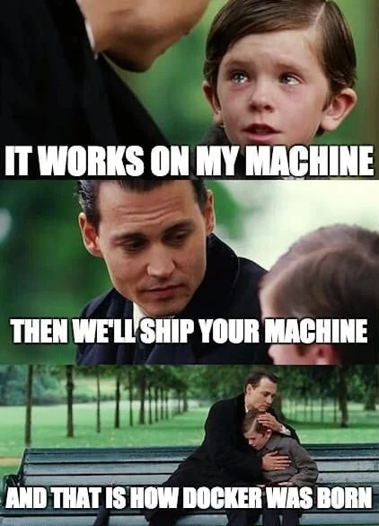

# Introduction to Docker with ROS 

<div style="text-align: center;">
    
</div>


## What is the proplem we need docker for?

The phrase **"It works on my machine"** highlights a common challenge in software development—environment inconsistencies that lead to bugs and deployment failures. Docker addresses this issue by providing a standardized environment for applications.

<div style="text-align: center;">
    
</div>


---

## Then, What is Docker?

Docker is an open-source platform that automates the deployment, scaling, and management of applications in lightweight, portable containers.

  - Docker was introduced in 2013 and has since become a standard for containerization.
  - It simplifies the process of developing, shipping, and running applications by encapsulating them in containers that can run consistently across different environments.
  - This "write once, run anywhere" capability eliminates the common "it works on my machine" problem.

## Key Components:

<div style="text-align: center;">
    
</div>


  - **Docker Engine:** The core part of Docker that creates and runs containers.
  - **Docker Images:** Immutable, read-only templates that define what is inside the container, including the operating system, application code, dependencies, and configuration.
  - **Docker Containers:** Runtime instances of Docker images. They are isolated environments that contain everything needed to run a specific application or service.
  - **Docker registry:** A cloud-based registry service for finding and sharing container images with the community.


## Docker vs. Traditional Virtual Machines:
  - **Virtual machines** run entire operating systems, each with its own kernel, on top of a **hypervisor**, making them heavier and slower to start.
  
  - **Docker containers** on the other hand, share the host OS's kernel and resources, which leads to faster startup times, less overhead, and more efficient resource usage.
  
  
**Here is a table that highlights the main differences between Docker and Virtual Machines (VMs):**

---
| **Aspect**                  | **Docker (Containers)**                                      | **Virtual Machine (VM)**                                |
|-----------------------------|--------------------------------------------------------------|---------------------------------------------------------|
| **Architecture**             | Uses the host OS kernel, creating lightweight containers.    | Uses a hypervisor to run full guest OS instances.        |
| **Isolation**                | Process-level isolation; shares the host OS kernel.         | Full isolation with dedicated OS and kernel per VM.      |
| **Boot Time**                | Starts in seconds or less (very fast).                      | Takes minutes to boot up (slow compared to containers).  |
| **Resource Usage**           | Lightweight, minimal overhead; shares OS resources.         | Heavy resource usage as each VM runs a full OS.          |
| **Size**                     | Small in size (MBs); containers only contain the application and dependencies. | Large in size (GBs); each VM includes an entire OS.     |
| **Performance**              | Near-native performance due to lightweight nature.           | Slower performance due to overhead from the full OS.     |
| **Portability**              | Highly portable across any environment with Docker installed. | Less portable, requires compatible hypervisor or hardware. |
| **Deployment Speed**         | Faster deployment due to smaller, lightweight containers.    | Slower deployment due to the need to boot full OS.       |
| **Scalability**              | Easily scalable with low resource consumption.               | Scalability is limited by higher resource requirements.  |
|

  
<div style="text-align: center;">
    
</div>

## Benefits of Containerization


- **Efficiency and Lightweight:**
  - Containers are more lightweight compared to virtual machines. They share the host OS’s kernel, which reduces the overhead and improves performance.
  - A single machine can run many more containers than it could virtual machines.

- **Isolation and Security:**
  - Containers provide isolation at the application level. This means that each container runs independently, without affecting others. If one container crashes or is compromised, it doesn't impact other containers on the same host.
  - Security mechanisms in Docker provide control over resources, access, and the environment in which the container runs.

- **Portability:**
  - Containers are highly portable. Once you create a Docker image, it can be run on any system that supports Docker, whether it’s a local machine, a cloud environment, or a cluster.

- **Scalability and Management:**
  - Docker makes it easier to scale applications. Containers can be quickly spun up or down based on demand.
  - Docker also integrates well with orchestration tools like Kubernetes, which manage and automate the deployment, scaling, and operation of containerized applications across clusters.

- **Simplified CI/CD Pipelines:**
  - Docker containers can be used to streamline Continuous Integration and Continuous Deployment (CI/CD) pipelines by providing consistent environments for building, testing, and deploying applications.
  - This reduces the time it takes to move from code to production and minimizes errors due to environmental differences.

  
## Why Use Docker with ROS?

<div style="text-align: center;">
    
</div>


Using Docker with ROS (Robot Operating System) offers several advantages that can significantly enhance the development, testing, and deployment of robotic applications. Here’s why Docker is a powerful tool when working with ROS:

### Simplifying ROS Environment Setup

- **Complex Dependencies:**
  - ROS applications often rely on a wide array of packages, libraries, and specific versions of software. Setting up a ROS environment manually can be time-consuming and prone to errors due to dependency conflicts or version mismatches.
  
- **Docker to the Rescue:**
  - Docker allows you to encapsulate all the dependencies, configurations, and the ROS environment itself into a single, portable container. 
  - By using a Dockerfile, you can automate the setup of a ROS environment, ensuring that all necessary dependencies are correctly installed and configured.

- **Quick Start for New Projects:**
  - With Docker, you can quickly spin up a new ROS environment by simply pulling a pre-configured ROS Docker image. This is particularly useful when starting a new project or when multiple team members need to work with the same setup.

## Install Docker on Ubuntu


Follow the steps below to install Docker on an Ubuntu system:

### 1. **Update Package Index**
Ensure your system is up-to-date by running:
```bash
sudo apt update
sudo apt upgrade
```

### 2. **Uninstall Old Versions**
If any older versions of Docker are installed, remove them:
```bash
sudo apt remove docker docker-engine docker.io containerd runc
```

### 3. **Install Required Packages**
Install necessary packages to allow apt to use repositories over HTTPS:
```bash
sudo apt install apt-transport-https ca-certificates curl software-properties-common
```

### 4. **Add Docker’s Official GPG Key**
Add Docker’s GPG key to verify packages:
```bash
curl -fsSL https://download.docker.com/linux/ubuntu/gpg | sudo gpg --dearmor -o /usr/share/keyrings/docker-archive-keyring.gpg
```

### 5. **Set Up Docker’s Stable Repository**
Add Docker’s official repository to apt sources:
```bash
echo "deb [arch=$(dpkg --print-architecture) signed-by=/usr/share/keyrings/docker-archive-keyring.gpg] https://download.docker.com/linux/ubuntu $(lsb_release -cs) stable" | sudo tee /etc/apt/sources.list.d/docker.list > /dev/null
```

### 6. **Update Package Index Again**
After adding the Docker repository, update your package index again:
```bash
sudo apt update
```

### 7. **Install Docker Engine**
Now install Docker from the Docker repository:
```bash
sudo apt install docker-ce docker-ce-cli containerd.io
```

### 8. **Verify Docker Installation**
To verify that Docker is installed and running, use the following command:
```bash
sudo systemctl status docker
```

### 9. **Run Docker Without `sudo` (Optional)**
To run Docker as a non-root user (without needing `sudo`), add your user to the Docker group:
```bash
sudo usermod -aG docker ${USER}
```
Then restart to apply the changes.

### 10. **Test Docker Installation**
Verify the installation by running a simple test:
```bash
docker run hello-world
```
### You also can use  [Docker Installation Script](../source-code/scripts/install_docker.sh)


## Pull and Run Your First ROS Docker Image

To pull and run a Docker image for the **Robot Operating System (ROS)**, follow these steps:

### 1. **Search for ROS Docker Images**
Docker Hub hosts official ROS images. You can browse through them at [Docker Hub - ROS](https://hub.docker.com/_/ros), but for simplicity, we'll use `ros:noetic-ros-core` (ROS Noetic is commonly used with Ubuntu 20.04).

### 2. **Pull the ROS Docker Image**
Run the following command to pull the desired ROS image from Docker Hub:
```bash
docker pull ros:noetic-ros-core
```

This pulls the base ROS Noetic image containing the core packages but no graphical tools.

### 3. **Run the ROS Docker Container**
To run a container with ROS, use the `docker run` command. Here’s an example of running the container interactively:
```bash
docker run -it ros:noetic-ros-core
```
The `-it` flag allows you to interact with the container's terminal.

### 4. **Verify ROS Installation Inside the Container**
Once inside the container, you can verify ROS is installed by checking the ROS version:
```bash
roscore
```
This will start the ROS core, indicating ROS is correctly installed and running within the Docker container.

### 5. **Exit the Container**
To exit the container, press `Ctrl + C` to stop ROS, then type:
```bash
exit
```